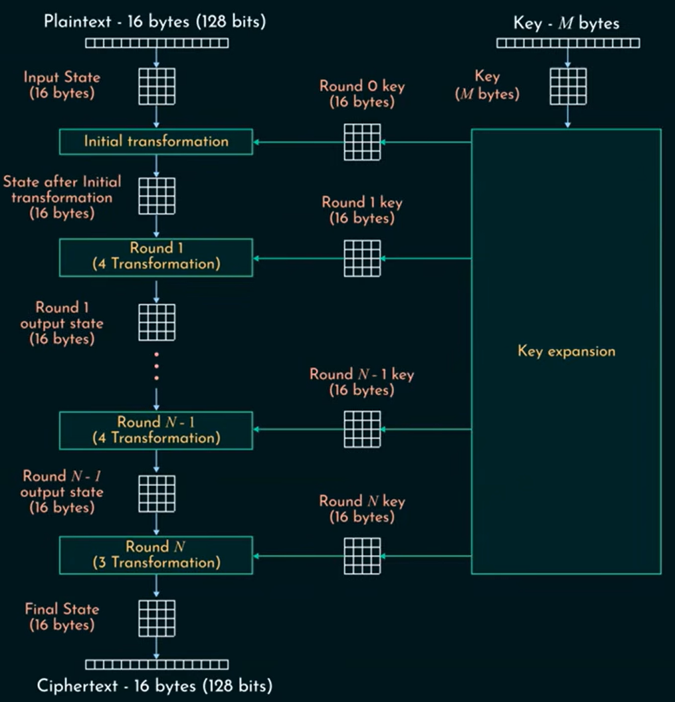

# AES128 IP Core with AXI4 Lite Interface

A custom AES128 IP Core for encrypting 128 bits plaintext using a 128 bit key, that is, ECB mode of encryption, is designed in Verilog. The IP is having AXI4 Lite protocol based interface to interact with the memory and the processor, which here is a testbench.

Below is a rough sketch of the whole design where the AES IP core is tested using a custom dual port slave memory (`axi_mem.v`) and a testbench (acting processor) are interfaces with the IP (`aes_top.v`) consisting the master interface (`axi_aes.v`), slave interface (`axi_ctrl.v`) and encryption pipeline (`aes.v`) with on the fly key expansion feature.

## Repository Structure

* `/rtl` - Contains all Verilog files of the AES128 IP Core along with the S-Box.

* `/env` - Contains the Verilog files of the top module and memory for creating environment outside the AES128 IP core.

* `/tb` - Contains the testbenches for testing the IP in various test cases of steady stable, backpressure and midflight key switch cases.

## IP Core Design

It consists of the `aes_top.v`, `aes.v`, `axi_aes.v` and `axi_ctrl.v`, along with the S-Box (`sbox.mem`).

### Encrytpion Math

* Under ECB mode, here plaintext processed block by block and each block is encrypted using a single key. Where each block gets its own subkey from the given encryption key, and done for 10 rounds.

* Here two pipelines are implemented where one of them produces subkeys for corresponding round every cycle if given the key, while another pipeline starts after the zeroth subkey produced thus parallelly running the math for every block.

* Every round consists of substituting bytes, shifting rows, mixing columns (except for last round) and XORing round subkey, and for key expansion galois function is used. These operations are done using the functions and generate features of Verilog so the math is implemented as pure combinational in between pipeline registers, as the data width is already known.

  

* Collects the plaintexts, key, start and other control signals from master interface and giving stalls, ready signals and ciphertext to it, and key valid signal from slave interface and outputting status to it.

* For the pipline control, when the first round is inactive then the ready signals given for new plaintext, and when the last second round is active the register is activated by the next cycle, thus ciphertext outputs the next cycle itself.

* Stall in pipeline is checked if both the last rounds are active as the AXI4 Lite interface allows the master interface to feed the 128 bit ciphertext to memory in 4 blocks of 32 bits, thus needing a stall check.

### AES Master Interface

* Communicates with the slave memory using AXI4 Lite protocol, with read and write FSMs implemented covering all cases required to halt and stall the pipeline.

* In read FSM, it is built with three states, READ0 waiting for the first read acting like an enable state, when data's available to read with all control signals satisfied it goes to next state READ1.

* The READ1 state is where the data is read continuously and checked with the total block to be read, if there's any error, the process is halted and sent to IDLE state.

* In write FSM, its built with three stages, WRITE_START state writes the first ciphertext block as soon as AES pipeline's done and enabling all control signals needed and goes to next state.

* In this WRITE_BUSY state, the writing is done continuously with check for after every one ciphertext written, and if done or stalled goes to IDLE where continuous check is done for continuing.

### AES Slave Interface

* Communicates with the processor (here a testbench) with AXI4 lite protocol, and works in writing the key and control registers, and reading out the status registers to the processor.

* It outputs the key to the pipeline, and control registers to master interface and takes input from pipeline for the status registers.

## Entire System Design

Implemented a dual port slave memory which would model and help in testing the working of IP in simulation with all kinds of scenarios using testbenches over the top module wrapping the memory module and AES top module.

### Slave Memory

* Designed a custom dual port slave memory with AXI4 Lite interfaces on both ports, one to communicate with the testbench and other with the AES module.

* Had implemented the AXI4 Lite protocol in such a way that while reading and writing as soon as the read/write data is used up from the channel and the valid comes the same time new address fed into the address channel if available, thus using a kind of overlapped protocol to speed up the communication (even though that latency is not considered for IP's performance).

* Also consists of feature for assigning address from the data channel directly and also if backpressure's given then to latch the addresses as done normally.

### Testbenches and Results

* There are three separate testbenches to separately test and gather the performance reports for the stable steady state, backpressure and midflight key switch cases, with 100 FIPS-197 test vectors.

* `top_steady_tb.v` - Tests for case where the the slave memory is always ready to output the data once fed in with the plaintexts by processor and always ready to take in the ciphertext from the AES module, thus creating no stalling or error condition anywhere thorughout the system. Thus achieving 3.055 Gbps throughput as per the testbench calculation.

* `top_key_switch_tb.v` - Tests for the case where the same as in steady state but with a change in key in between the process by the testbench. As we use key valid to ensure that until key is stable, the previous key is used thus we see that after 45th encryption the new key is sent as we don't stall the process the we see the new key used after 49th plaintext, with no drop in throughput.

* `top_backpressure_tb.v` - Tests the condition where memory is not ready to take the ciphertexts in from the AES module, and to give the plaintext out to the AES module. Thus we successfully verify the correctness of the IP core with no data corruption with random stall generation.

### Vivado Implementation Reports of the IP core

*With clock constraint of 2.5 ns period*

| Metric | Value |
| ----- | ----- |
| **LUT** | 9760 | 
| **FF** | 3684 | 
| **BRAM** | 0 | 
| **URAM** | 0 | 
| **DSP** | 0 | 
| **WNS (Worst Negative Slack)** | 0.261 ns |
| **WHS (Worst Hold Slack)** | 0.018 ns |
| **WPWS (Worst Pulse Width Slack)** | 0.975 ns |
| **Total On Chip Power**| 0.77 W |

Thus with 2.5 ns clock constraint checked, the IP core itself can operate with a clock of more than 400 MHz frequency.
